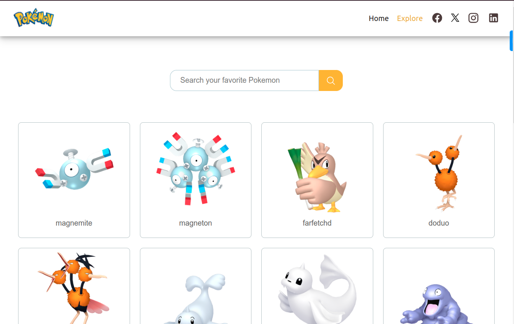
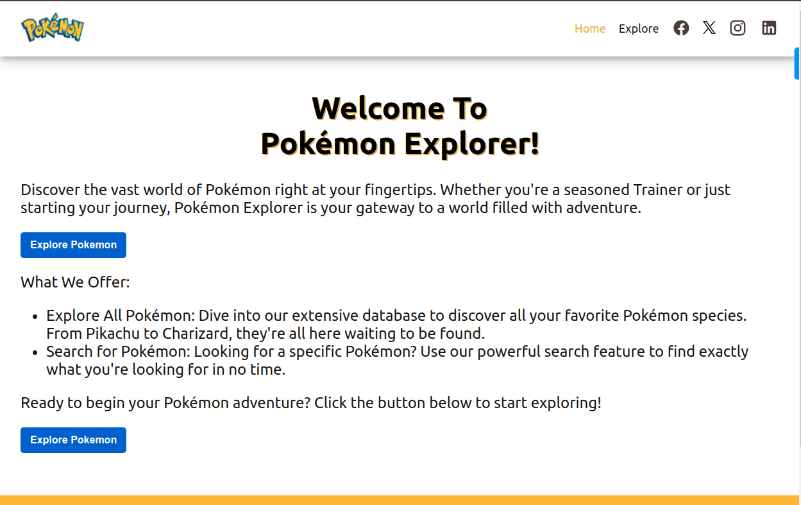

# Pokemon Explorer

Discover the vast world of Pokémon right at your fingertips. Whether
you're a seasoned Trainer or just starting your journey, Pokémon
Explorer is your gateway to a world filled with adventure.

- Explore All Pokémon: Dive into our extensive database
  to discover all your favorite Pokémon species. From Pikachu to
  Charizard, they're all here waiting to be found.
  
- Search for Pokémon: Looking for a specific Pokémon?
  Use our powerful search feature to find exactly what you're
  looking for in no time.

## Built With

- React
- TypeScript
- Redux
- Javascript

# Demo Links

[View App Online](https://pokemon-challenge-n1d3.onrender.com/)

# Screenshot

---

## Getting Started

- In your local PC, open your terminal in the folder you would like to clone the repository into
- Clone the repository with the command: `git clone git clone https://github.com/HENRYKC24/pokemon-challenge.git`
- After the clone, type in the command `cd pokemon-challenge` to access the app directory on the terminal
- Run `npm install` to get all the project dependancies.
- Run `npm start` to start the dev-server.

## Author

👤 **Henry Kc**

- GitHub: [@githubhandle](https://github.com/henrykc24)
- Twitter: [@twitterhandle](https://twitter.com/henrykc24)
- LinkedIn: [LinkedIn](https://linkedin.com/in/henry-kc)

## Contributing

Contributions, issues, and feature requests are welcome!
Feel free to contribute

## Show your support

Give a ⭐️ if you like this project!

## Acknowledgments

- I remain indepted to the Facebook team that develop create-react-app and React Redux as open source.
- A special thanks to everyone, who has contributed in one way or the other to make this project possible. I really appreciate.

## 📝 License

This project is [MIT](./LICENSE) licensed.
